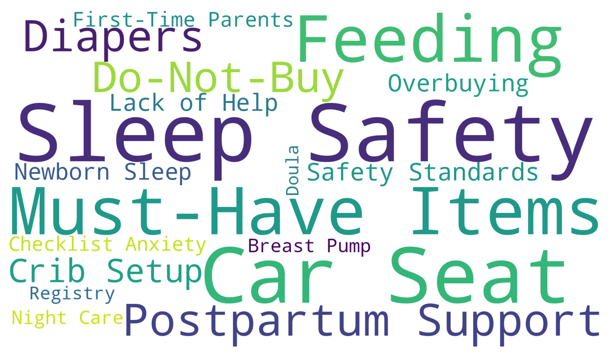

# 🍼 NewbornHelper
### A Data-Informed Newborn Preparation Guide  
### for Chinese Parents in the U.S.

> **给在美国刷小红书也刷不明白的新手华人父母**  
> 一套基于真实社区痛点、以安全与决策优先级为核心的新生儿准备指南

---

## 👋 如果你正在经历这些……

- 怀孕中 / 即将生产  
- 小红书、微信群、朋友清单刷了一大堆  
- 每个人都在推荐，但你发现：
  - 说法互相矛盾
  - 很多经验并不适用于美国
  - 买得越多，越不安心

如果你在想：

> *“到底哪些一定要买？”*  
> *“哪些在美国其实是危险或不推荐的？”*  
> *“我现在这个阶段最该做的事是什么？”*

👉 **NewbornHelper 就是为解决这些问题而存在的。**

---

## 🎯 NewbornHelper 在做什么？

NewbornHelper 不是一个“种草清单”，  
而是一个 **decision-support style 的准备指南**。

它关注的不是：
- 哪个品牌最好
- 哪个神器最火

而是：
- **什么是必须的**
- **什么是不该买的**
- **什么时候该买“人”的帮助，而不是“东西”**

---

## 🔍 Evidence: Real Pain Points from the Community

NewbornHelper 的结构并非拍脑袋决定。

我们对**北美华人父母在小红书上的新生儿相关讨论**进行了整理与分析，
识别出被反复提及的共性焦虑与决策痛点，
并将它们抽象为可执行的准备逻辑。

下面的图展示了这些**高频痛点主题的聚类结果**：

**你会看到，这些反复出现的关注点集中在：**
- Sleep Safety & Crib Setup
- Car Seat & Transportation
- Diapers & Feeding
- Overbuying Anxiety
- Must-Have vs Do-Not-Buy Confusion
- Postpartum Support & Lack of Help

👉 **NewbornHelper 的所有内容，正是对这些痛点的系统回应。**

（详细方法见 [`evidence.md`](./evidence.md)）

---

## 🧠 核心原则（请先读）

1. **安全 > 实用 > 服务 > 体验 > 情绪安慰型消费**
2. **先保证“不会出问题”，再考虑“是否更舒服”**
3. **不知道宝宝之前，不要假设宝宝**
4. **信息越多，越需要 checklist 思维**

---

## 📚 项目内容一览（推荐阅读顺序）

### 🗓️ 1️⃣ 时间线准备计划（核心文档）
📄 [`newborn_prep_plan.md`](./newborn_prep_plan.md)

- 以 **预产期（EDD）为时间轴**
- 拆成 4 个阶段（-120 → 0 天）
- 每 30 天告诉你：
  - 现在最该做什么
  - 该买什么 / 不该买什么
  - 什么时候该准备 support

---

### ✅❌ 2️⃣ 必须买 / 千万别买（中英对照）
📄 [`checklist.md`](./checklist.md)

- 明确区分：
  - ✅ **Must-Have**
  - ❌ **Do-Not-Buy / High-Risk**
- 每一条都解释 *why*
- 中英对照，方便与伴侣或长辈沟通

---

### ❌ 3️⃣ Top 10 常见错误
📄 [`top10_common_mistakes.md`](./top10_common_mistakes.md)

- 在美国养新生儿  
  华人父母最常踩的 10 个坑
- 重点不是“你做错了什么”，  
  而是“哪些错误代价最高”

---

### 🤝 4️⃣ Helper 决策指南
📄 [`helper_guide.md`](./helper_guide.md)

- 什么时候该请人？
- 请什么人最有用？
- 钱该花在哪一段？

---

### 🔍 5️⃣ 方法与证据
📄 [`evidence.md`](./evidence.md)

- 痛点来自哪里
- 为什么这样拆结构
- 为什么刻意避免复杂模型

---

## 🚫 我们明确不做的事

- ❌ 不做品牌测评或排行榜
- ❌ 不“种草神器”
- ❌ 不鼓励过度消费
- ❌ 不否定个人选择，但会**明确标注风险**

---

## 🔒 关于安全规范

本项目基于美国长期形成的安全共识，包括但不限于：
- American Academy of Pediatrics (AAP)
- U.S. Consumer Product Safety Commission (CPSC)
- CDC / American Red Cross

如果某个做法：
- 在华人社区“很常见”
- 但在美国被列为高风险  

**NewbornHelper 会明确指出。**

---

## 👨‍👩‍👧 这个项目适合谁？

✔️ 居住在美国  
✔️ 新手父母  
✔️ 希望遵循美国安全与医疗体系  
✔️ 不想靠焦虑消费建立安全感  

❌ 如果你只想找“哪个品牌最好”  
❌ 如果你主要在美国以外育儿  

这个 repo 可能不完全适合你。

---

## 🧩 推荐使用方式

1. ⭐ Star 本仓库（当作冷静参考）
2. 👉 先看 `checklist.md`
3. 👉 再按时间线读 `newborn_prep_plan.md`
4. 🖨️ 打印 checklist，贴在冰箱上
5. 🤝 转给正在焦虑的朋友

---

## ⚠️ 免责声明

> 本项目为经验整理与信息汇总，不构成医疗或法律建议。  
> 所有涉及医疗、喂养、睡眠与安全决策，请以你的儿科医生与产科医生建议为准。

---

> **If this repo helps you buy less, worry less, and sleep a bit more —  
> it has done its job.**
